import { Code, FileTree, Steps } from '@astrojs/starlight/components';
import LearnMore from '../../../components/LearnMore.astro';
import SimpleAppHostCode from '../../../components/SimpleAppHostCode.astro';

Aspire's **AppHost** is where you define your app's services and dependencies in code—no complex configs required. Easily map out your architecture and let Aspire handle the local orchestration, so you can focus on building features.

## Defining Your Architecture

Consider a three-tier architecture where your frontend talks to an API, and your API connects to a database:

```mermaid
architecture-beta

  service db(logos:postgresql)[PostgreSQL]
  service api(logos:dotnet)[API Service]
  service frontend(logos:react)[Frontend]

  api:R --> L:db
  frontend:R --> L:api
```

This could be represented in the `AppHost` as shown in the following code:

<SimpleAppHostCode />

Regardless of the language you choose, Aspire provides a consistent way to define your app's architecture. You can easily add services, set up dependencies, and configure how they interact—all in a straightforward, code-first manner.

## How the AppHost Works

The AppHost project serves as the orchestration layer for your distributed application. When you run the AppHost:

<Steps>
1. **Service Discovery**: Aspire automatically discovers all the services and resources defined in your AppHost
1. **Dependency Resolution**: Services are started in the correct order based on their dependencies
1. **Configuration Injection**: Connection strings and service endpoints are automatically injected into your services
1. **Health Monitoring**: Aspire monitors the health of all services and can restart them if needed
</Steps>

<LearnMore>
  Dive deeper into Aspire's orchestration and discover how it manages your resources in the AppHost's [Resource Model](/aspire/architecture/resource-model).
</LearnMore>

## AppHost Project Structure

The template AppHost project contains:

<FileTree>
- **AspireApp.AppHost**
    - Properties
      - launchSettings.json
    - appsettings.Development.json
    - appsettings.json
    - AspireApp.AppHost.csproj
    - AppHost.cs
</FileTree>

## AppHost Lifecycle Events

The AppHost provides several lifecycle events that you can subscribe to for custom behavior during the app's startup process. These events allow you to hook into key moments in the lifecycle of your application, such as before the app starts or after resources are created.

<Steps>
1. `BeforeStartEvent`: Raised before the app host starts.
1. `AfterEndpointsAllocatedEvent`: Raised after the app host has allocated endpoints for all services.
1. `AfterResourcesCreatedEvent`: Raised after all resources have been created.
</Steps>

<LearnMore>
  For more granular control over resource lifecycles, explore the [well-known lifecycle events](/aspire/architecture/resource-model/#well-known-lifecycle-events) available in Aspire's Resource Model.
</LearnMore>

## Best Practices

- **Keep it Simple**: Start with a minimal `AppHost` and add complexity as needed.
- **Use Dependencies**: Clearly define which services depend on others using `.WithReference(...)`.
- **Environment Configuration**: Use different configurations for development, testing, and production.
- **Resource Naming**: Use clear, descriptive names for your resources to make debugging easier.
