import { Code, FileTree, Steps } from '@astrojs/starlight/components';
import SimpleAppHostCode from '../../../components/SimpleAppHostCode.astro';

Aspire's **AppHost** is where you define your app's services and dependencies in code—no complex configs required. Easily map out your architecture and let Aspire handle the local orchestration, so you can focus on building features.

## Defining Your Architecture

A simple example might represent a common three-tier architecture with a frontend that depends on an API, which in turn connects to a database:

```mermaid
architecture-beta

  service db(logos:postgresql)[PostgreSQL]
  service api(logos:dotnet)[API Service]
  service frontend(logos:react)[Frontend]

  frontend:L <-- R:api
  api:L <-- R:db
```

This could be represented in the AppHost as shown in the following code:

<SimpleAppHostCode />

Regardless of the language you choose, Aspire provides a consistent way to define your app's architecture. You can easily add services, set up dependencies, and configure how they interact—all in a straightforward, code-first manner.

## How the AppHost Works

The AppHost project serves as the orchestration layer for your distributed application. When you run the AppHost:

<Steps>
1. **Service Discovery**: Aspire automatically discovers all the services and resources defined in your AppHost
1. **Dependency Resolution**: Services are started in the correct order based on their dependencies
1. **Configuration Injection**: Connection strings and service endpoints are automatically injected into your services
1. **Health Monitoring**: Aspire monitors the health of all services and can restart them if needed
</Steps>

## AppHost Project Structure

A typical AppHost project contains:

<FileTree>
- **AspireApp.AppHost**
    - Properties
      - launchSettings.json
    - appsettings.Development.json
    - appsettings.json
    - AspireApp.AppHost.csproj
    - AppHost.cs
</FileTree>

## Best Practices

- **Keep it Simple**: Start with a minimal AppHost and add complexity as needed
- **Use Dependencies**: Clearly define which services depend on others using `.WithReference()`
- **Environment Configuration**: Use different configurations for development, testing, and production
- **Resource Naming**: Use clear, descriptive names for your resources to make debugging easier
